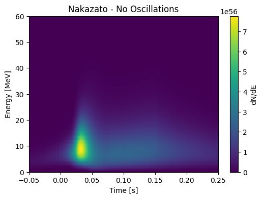

# SuperNova-Work


This repository is dedicated to the simulation work working regarding the SuperNova neutrinos. 

It contains the complete simulation package, where photon propagation happens using both Geant4 and Opticks (If Opticks is installed)

1) To start the simulation under the output repository access the SNEWPY_JSON_Root_File_Generation Jupyter Notebook.

2) Run the script using which ever model you're interested in, currently this script is setup to run Nakazato and Bollig models.
   The script will generat two files, a JSON file used as a config file for Marley and a root file with a TH2D of the chosen model and oscillation profile. (Energy vs Time vs Flux)

   
3) Under macros directory, open the Template_Supernova_Neutrino macro file. There change the appropriate naming conventions, 
   for the JSON config file, the TH2D file path, output name and path and finally the beam on for the number of instances or events you want to run. 
4) Now to run the actual siulation, create the directory *mkdir buid* and *cd build* 

5) Then run *cmake ..* 

6) Followed by make to build the simulation

7) Finally run *cd ..* the build directory and run * ./sim.sh*


This Python script processes and visualizes neutrino flux data from the Garching supernova simulations. It reads time-bin mappings from garching_pinched_info_key.dat and corresponding alpha, energy, and luminosity values from garching_pinched_info.dat, matching them based on their first-column IDs. The script then organizes and filters the data, ensuring proper alignment before plotting time-dependent trends for different neutrino species (ν_e, ν̅_e, ν_x). The visualization includes logarithmic scaling, core bounce reference, and distinct line styles for clarity. This approach streamlines data processing by eliminating filename-based ID extraction and directly leveraging structured data matching.

Running the code will yield this kind of graph:


With the axis matching to the original DUNE Paper: https://arxiv.org/pdf/2008.06647. The vertical line at 0.02s signifies the core bounce.

## Addendum: Semi-Analytical ROOT Output Mode

For large event samples, the full ROOT output can be larger than needed for the QPix semi-analytical workflow. A runtime flag was added to trim the `event_tree` while still saving the Geant4 optical photon tree.

Add this command to the macro before `/run/initialize`:

```text
/inputs/semi_analytical_output true
```

When this flag is `true`, `event_tree` only writes the branches needed by the semi-analytical method:

```text
run
hit_start_x
hit_end_x
hit_start_y
hit_end_y
hit_start_z
hit_end_z
hit_start_t
hit_end_t
hit_energy_deposit
hit_length
```

The Geant4 optical photon tree is still written as `G4_Photons` with:

```text
event_id
photon_hit_x
photon_hit_y
photon_hit_z
photon_hit_t
photon_hit_wavelength
```

The `metadata` tree is also still written because it is small and records detector dimensions/configuration. If `/inputs/semi_analytical_output true` is not set, the simulation keeps the normal full ROOT output.

Example macro fragment:

```text
/inputs/generator MARLEY
/inputs/particle_type MARLEY
/inputs/MARLEY_json ../cfg/marley_config.js
/inputs/output_file ../output/MARLEY_slim.root
/inputs/semi_analytical_output true

/run/initialize
/run/beamOn 1000
```

Current Mac/Apple Silicon build usage:

```bash
cd /Users/jacob/Programs/Library/SuperNova-Work
cmake -S . -B build -DWith_Opticks=OFF -DWITH_GEANT4_UIVIS=OFF
cmake --build build --parallel 1
cd macros
../build/app/G4_QPIX test.mac
```

Notes:

- `With_Opticks=OFF` is required on this Mac setup because Opticks requires CUDA.
- `WITH_GEANT4_UIVIS=OFF` builds the batch-mode executable without the Geant4 UI/visualization dependencies.
- `cmake --build build --parallel 1` only limits compile jobs. Runtime is single-threaded because the app uses the serial Geant4 run manager.
- The semi-analytical flag was added as a runtime macro command in `ConfigManager`, and `AnalysisManager` uses it when booking ROOT branches.

Implementation details for the flag:

- `src/ConfigManager.h:52` adds `GetSemiAnalyticalOutput()`.
- `src/ConfigManager.h:92` adds `SetSemiAnalyticalOutput(...)`.
- `src/ConfigManager.h:148` adds the private `semiAnalyticalOutput_` member.
- `src/ConfigManager.cpp:49` initializes the flag to `false` by default.
- `src/ConfigManager.cpp:69` copies the flag into worker/thread-local config instances.
- `src/ConfigManager.cpp:121` registers the macro command `/inputs/semi_analytical_output`.
- `src/ConfigManager.cpp:178` prints the flag in the configuration dump.
- `src/AnalysisManager.cpp:94` reads the flag when booking the ROOT trees.
- `src/AnalysisManager.cpp:100` starts the `if (!semiAnalyticalOutput)` block that keeps the full-output-only branches out of slim mode.
- `src/AnalysisManager.cpp:173-182` always books the semi-analytical hit branches, so they are present in both full and slim output modes.
- `src/AnalysisManager.cpp:184` continues into the optical photon tree booking, so `G4_Photons` is still saved in slim mode.
